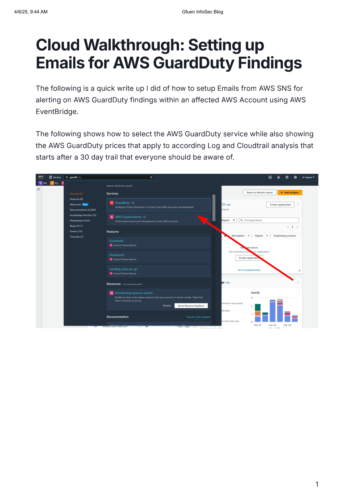
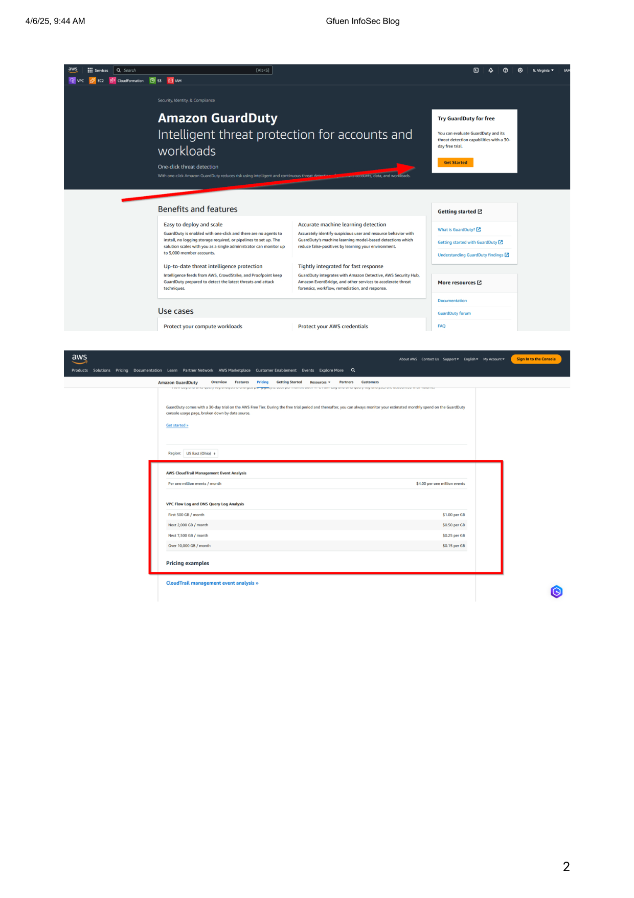
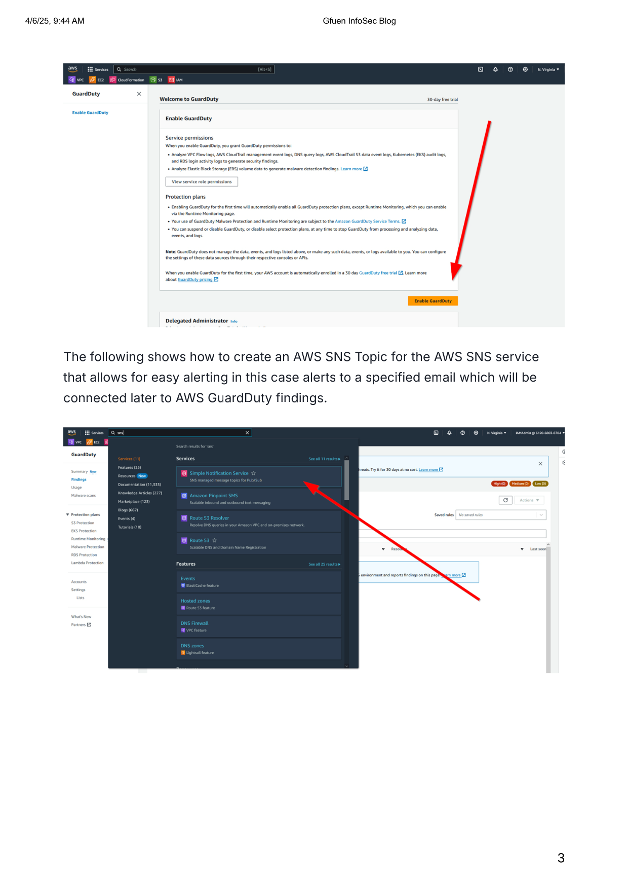
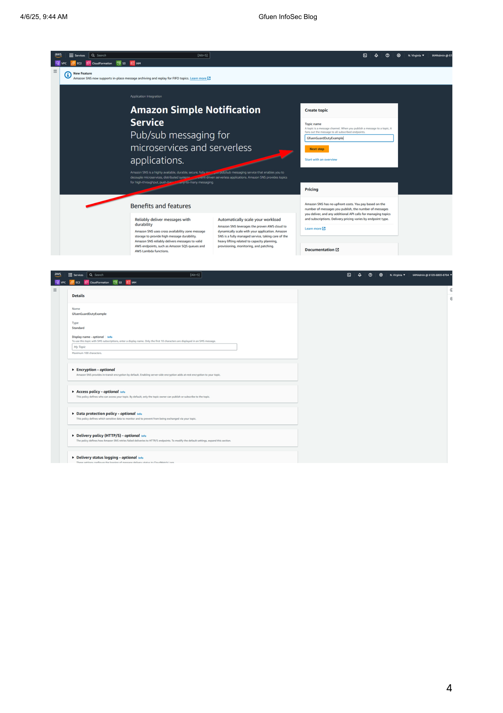
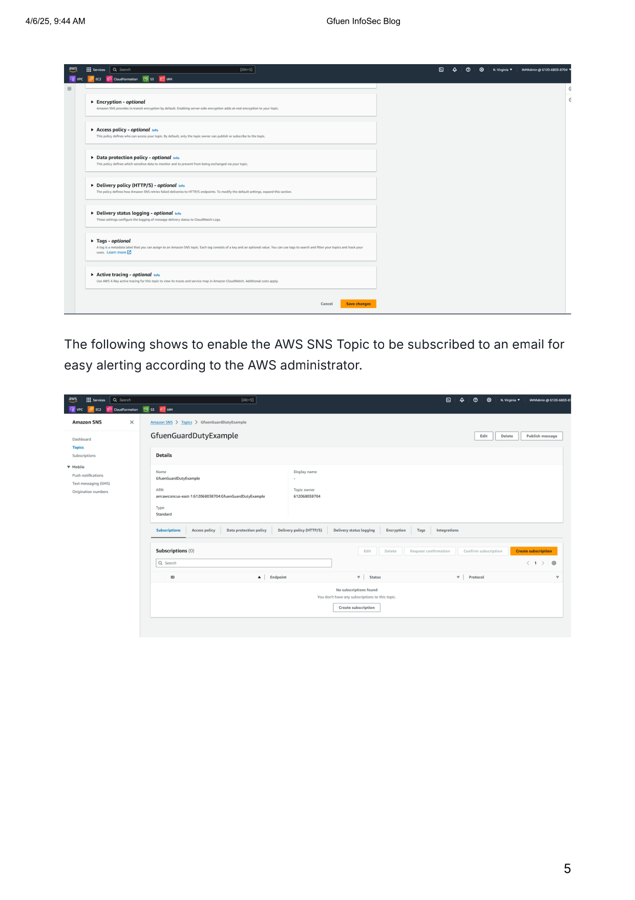
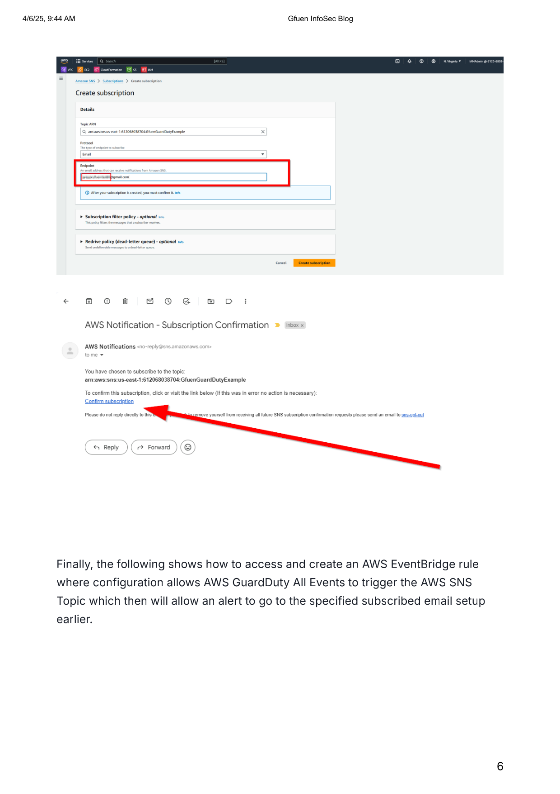
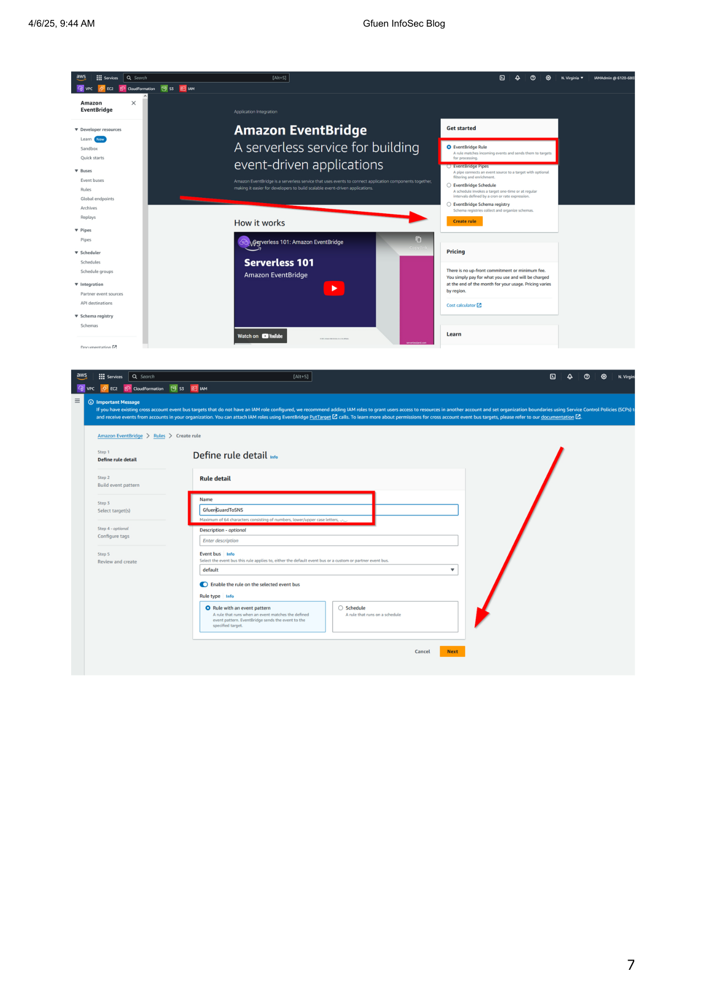
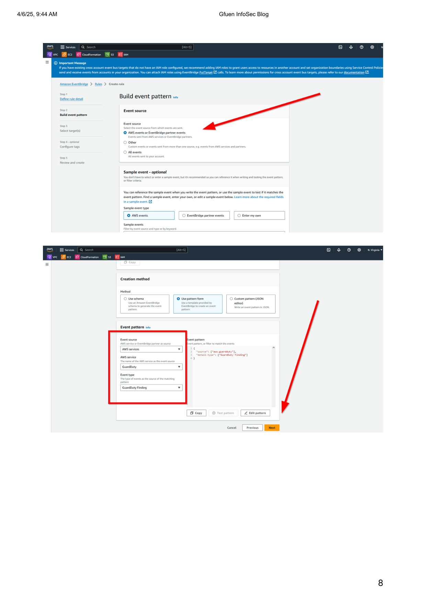
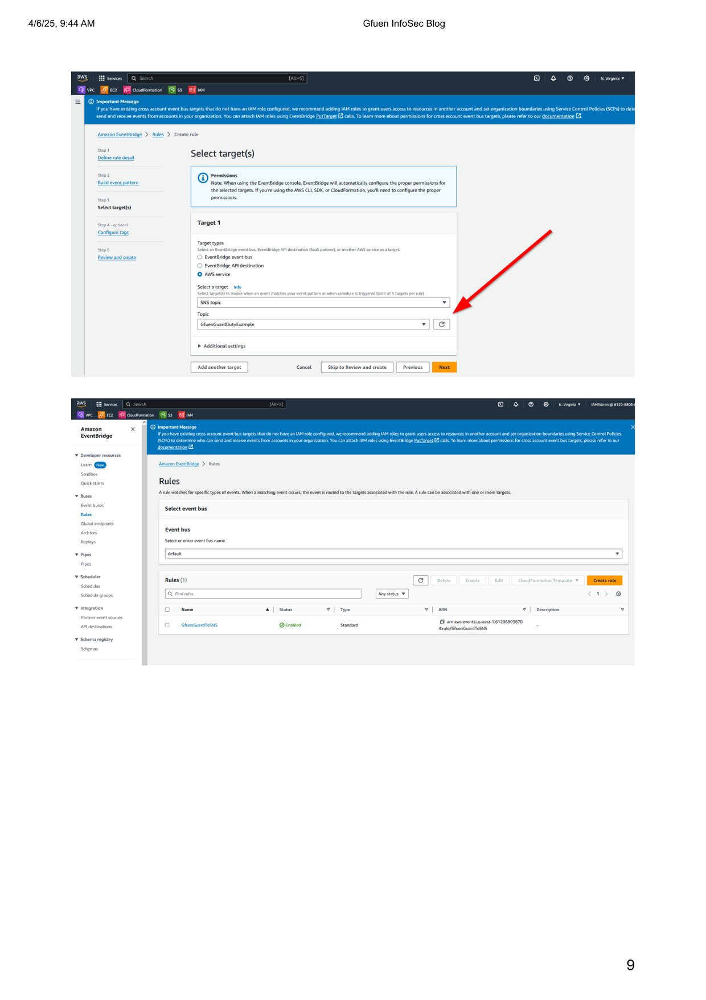

# AWSGuardDutySetup
## Source File
[sourceFile](./AWSGuardDutySetup/src/AWSGuardDutySetup)

 

- - -

 

* 

 

- - -

 

* 

 

- - -

 

* 

 

- - -

 

* 

 

- - -

 

* 

 

- - -

 

* 

 

- - -

 

* 

 

- - -

 

* 

 

- - -

 

* 

 

