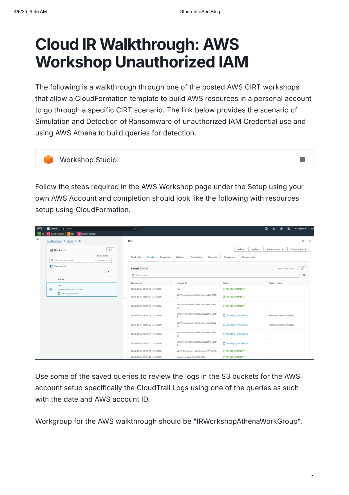
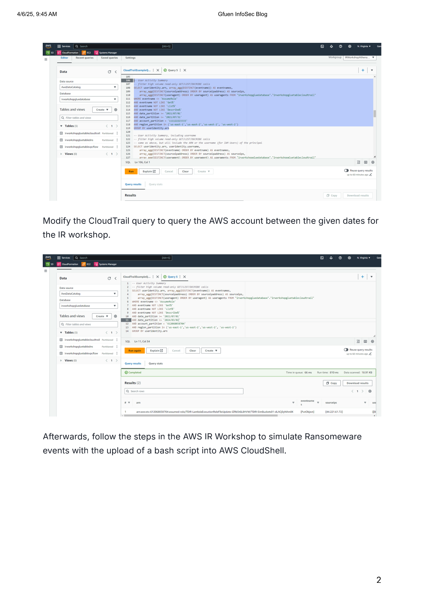
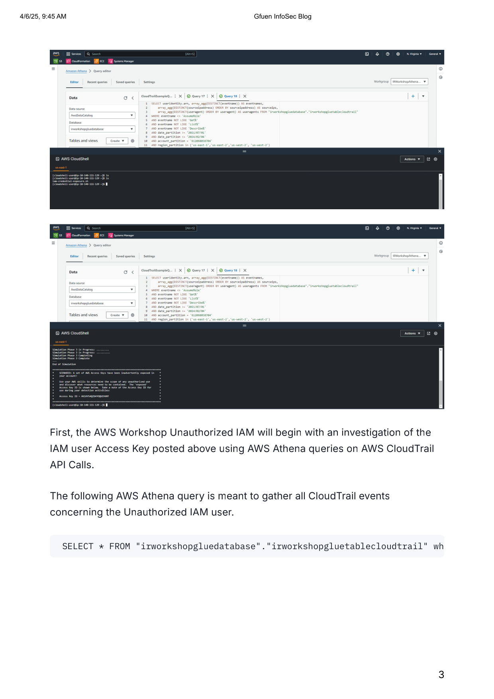
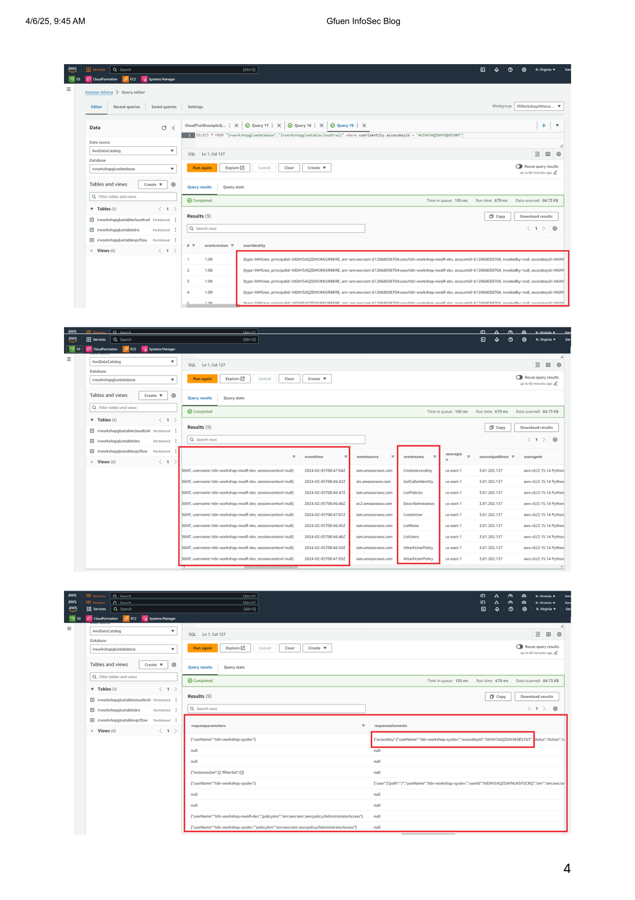
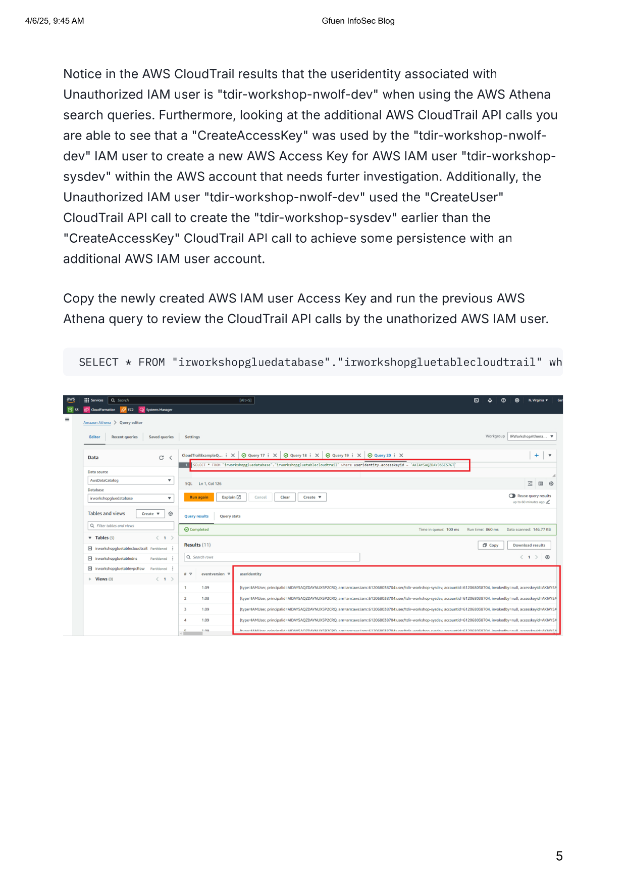
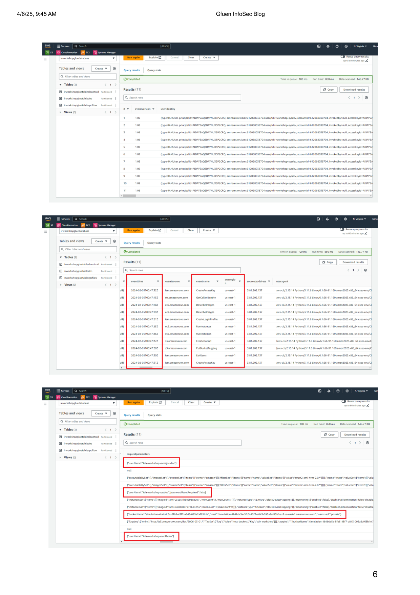

# AWSUnauthIAM
## Source File
[sourceFile](./AWSUnauthIAM/src/AWSUnauthIAM)

 

- - -

 

* 

 

- - -

 

* 

 

- - -

 

* 

 

- - -

 

* 

 

- - -

 

* 

 

- - -

 

* 

 

- - -

 

* 

 

